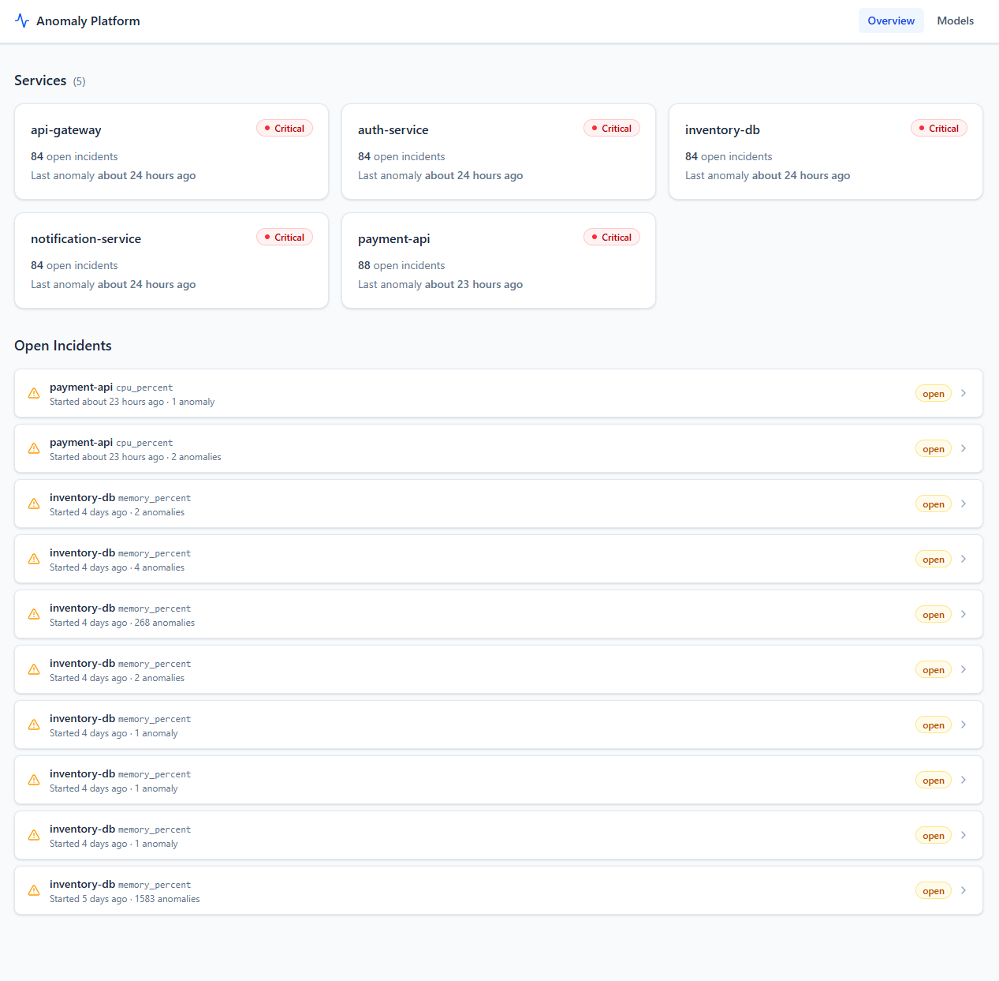

# Anomaly Detection Platform

[](https://github.com/meinaxie3/anomaly-platform/actions/workflows/ci.yml)

A full-stack ML platform that watches microservice metrics in real time, automatically learns what "normal" looks like for each service, and raises alerts when behaviour deviates — without any manually configured thresholds.

**Built with:** Python · FastAPI · Redis Streams · TimescaleDB · scikit-learn · React · TypeScript

---

## What it does

| Component | Role |
|-----------|------|
| **Load generator** | Simulates 5 microservices emitting metrics every 10 seconds |
| **Ingestion API** | Validates incoming metric events and pushes them to a Redis Stream |
| **Stream consumer** | Reads the stream, writes raw metrics to TimescaleDB, and calls the Inference API |
| **Inference API** | Scores each metric reading against a trained Isolation Forest model; writes anomalies to the DB |
| **Alert engine** | Groups related anomalies into incidents and deduplicates repeat alerts |
| **Training job** | Runs nightly — fits a new model per service+metric, evaluates it, and stores it in MinIO |
| **Dashboard API** | Read-only FastAPI service that powers the React frontend |
| **React dashboard** | Three-view UI: service health overview, per-metric time-series charts, and model registry |

---

## Screenshots

**Service health overview** — see all services at a glance, with open incident counts and health status


**Service detail** — click any service to see its metric charts with anomaly markers overlaid


**Model registry** — browse trained models with precision, recall, and F1 scores colour-coded by quality


**Dashboard API docs** (http://localhost:8003/docs)


**Ingestion API docs** (http://localhost:8001/docs)


**Inference API docs** (http://localhost:8002/docs)


---

## Architecture

```
┌──────────────────┐
│  Load Generator  │  (synthetic traffic + injectable spikes)
└────────┬─────────┘
         │ POST /ingest  (JSON metric events)
         ▼
┌──────────────────┐      ┌──────────────────────┐
│  Ingestion API   │─────▶│   Redis Streams       │
│  FastAPI :8001   │      └──────────┬───────────┘
└──────────────────┘                 │
                                     ▼
                          ┌──────────────────────┐
                          │   Stream Consumer    │  fan-out worker
                          └──────┬───────┬───────┘
                                 │       │
                    ┌────────────┘       └─────────────┐
                    ▼                                   ▼
           ┌──────────────┐                  ┌──────────────────┐
           │ TimescaleDB  │◀─────────────────│ Inference API    │
           │  :5432       │   anomaly write  │ FastAPI :8002    │
           │ metrics      │                  └────────┬─────────┘
           │ anomalies    │                           │ anomaly event
           │ incidents    │                           ▼
           │ model_reg.   │                  ┌──────────────────┐
           └──────┬───────┘                  │  Alert Engine    │
                  │                          │  dedup + group   │
                  │ nightly                  └────────┬─────────┘
                  ▼                                   │ incident write
           ┌──────────────┐                           │
           │ Training Job │──→  MinIO model store     │
           │ (APScheduler)│     :9000                 │
           └──────────────┘                           ▼
                                           ┌──────────────────────┐
                                           │  Dashboard API       │
                                           │  FastAPI :8003       │
                                           └──────────┬───────────┘
                                                      ▼
                                             ┌─────────────────┐
                                             │  React UI :5173 │
                                             └─────────────────┘
```

**Training path:** TimescaleDB → Training Job → MinIO → Inference API loads the model on startup.

---

## Quickstart

### Prerequisites

| Tool | How to install |
|------|----------------|
| **Docker** (with Compose v2) | [docker.com](https://www.docker.com/products/docker-desktop/) — verify with `docker compose version` |
| **uv** (Python package manager) | `curl -LsSf https://astral.sh/uv/install.sh \| sh` |
| **Node.js ≥ 18** | [nodejs.org](https://nodejs.org/) — only needed for the React dashboard |

> **Windows users:** the `make` commands below require WSL 2 or Git Bash. If you prefer native PowerShell, use `.\scripts\start.ps1` instead — it opens each service in its own terminal window automatically.

---

### Step 1 — Clone and configure

```bash
git clone https://github.com/meinaxie3/anomaly-platform.git
cd anomaly-platform
cp .env.example .env          # defaults work for local development
```

### Step 2 — Install dependencies

```bash
uv sync --all-packages        # Python workspace packages → .venv
cd services/dashboard && npm install && cd ../..   # React dependencies
```

### Step 3 — Start the database, cache, and object store

```bash
docker compose -f infra/docker-compose.yml up -d --wait
```

This starts PostgreSQL (TimescaleDB), Redis, and MinIO, and waits until all three pass their health checks.

### Step 4 — Start all services

**Linux / macOS / WSL:**
```bash
bash scripts/start.sh
```

**Windows (PowerShell):**
```powershell
.\scripts\start.ps1
```

Both scripts start the 5 Python services and the React dev server, then ask if you want to start the load generator.

**Or start each service manually** in separate terminals:
```bash
make run-ingestion      # Ingestion API       → http://localhost:8001
make run-consumer       # Stream consumer worker
make run-inference      # Inference API       → http://localhost:8002
make run-alerts         # Alert engine
make run-dashboard-api  # Dashboard API       → http://localhost:8003
make run-ui             # React dashboard     → http://localhost:5173
```

### Step 5 — Generate traffic

```bash
make run-load-gen       # streams synthetic metrics to the Ingestion API
```

### Step 6 — Train the models

The Inference API needs trained models before it can score metrics. Wait a few minutes for the load generator to accumulate data, then run:

```bash
make run-training       # trains one model per service+metric and exits
```

After this, the **Models** page in the dashboard shows precision, recall, and F1 scores for each trained model.

### Step 7 — Verify everything is working

```bash
make verify-dod-6
```

---

## Service URLs

| Service | URL |
|---------|-----|
| React dashboard | http://localhost:5173 |
| Dashboard API (Swagger) | http://localhost:8003/docs |
| Ingestion API (Swagger) | http://localhost:8001/docs |
| Inference API (Swagger) | http://localhost:8002/docs |
| MinIO console | http://localhost:9001 — login: `minio` / `minio123` |

---

## How anomaly detection works

### The core idea

Instead of writing rules like `if cpu > 80% → alert`, the platform trains a machine learning model on weeks of historical data and learns what *normal* looks like for each individual service and metric. A reading is flagged as an anomaly when it is statistically unusual compared to history — regardless of which direction.

This means:
- **No thresholds to configure** — the model adapts to each service automatically
- **Time-aware** — a CPU reading of 75% at 3am can be anomalous even if 75% is normal at noon
- **Catches drops too** — a sudden drop in `latency_p50` (service responding suspiciously fast) is just as suspicious as a spike, and may mean the service is short-circuiting and returning errors

### The ML algorithm — Isolation Forest

Isolation Forest works by randomly partitioning the data using decision trees. Points that are easy to isolate (need very few cuts to separate from the rest) get a high anomaly score. Points deep inside a cluster of normal data need many cuts and score low.

The model is **unsupervised** — it is never shown labelled examples of anomalies. It learns purely from the distribution of normal traffic.

### Simple threshold vs ML

| Simple threshold alerting | This platform |
|---|---|
| `if cpu > 80% → alert` | No hardcoded number |
| Fires at 81% even at 3am when that's normal | Knows 3am baseline is different |
| Silent if normal is 90% and value drops to 50% | Catches drops too |
| Must be configured manually per service | Separate model per service + metric, trained automatically |

### Pipeline — from metric to dashboard

```
Load Generator
    │  emits cpu_percent = 42.3 every 10 s
    ▼
Ingestion API → Redis Stream → Consumer
                                   │
                                   ▼
                             Inference API
                             (scores reading against trained model)
                                   │
                        ┌──────────┴──────────┐
                        │                     │
                      normal               ANOMALY
                        │                     │
                   do nothing         write to anomalies table
                                             │
                                             ▼
                                       Alert Engine
                                    (groups into Incident)
                                             │
                                             ▼
                                    Dashboard red dot
```

---

## Metrics reference

Five synthetic services are simulated, each emitting 7 metrics. Baselines below are for `payment-api`.

| Metric | Unit | What it measures | Normal baseline | An anomaly means… |
|---|---|---|---|---|
| `cpu_percent` | % | CPU consumed by the service | ~42% | Runaway process, traffic surge, or slow query |
| `memory_percent` | % | RAM in use as a share of total | ~58% | Gradual climb = memory leak; sudden jump = large allocation |
| `request_rate` | req/s | Requests arriving per second | ~120 | Spike = retry storm; drop = upstream service failing |
| `latency_p50` | ms | Median response time | ~45 ms | The typical user experience has got worse |
| `latency_p95` | ms | 95th-percentile response time | ~120 ms | Slow tail latency is affecting many users |
| `latency_p99` | ms | 99th-percentile response time | ~280 ms | Worst-case experience — often GC pauses or lock contention |
| `error_rate` | 0–1 | Fraction of requests that errored | ~0.5% | Even a small rise is serious — users are hitting failures |

**Why three latency metrics?** A fast average can hide a painful experience for a small percentage of users. p50 tells you if the typical experience is good; p95 tells you if most users are happy; p99 tells you if the worst cases are acceptable. Anomalies at p99 but not p50 often point to something intermittent (garbage collection, cache misses). Anomalies across all three mean the whole service is struggling.

---

## ML evaluation

Each time the training job runs it:

1. Loads the last 30 days of metrics from TimescaleDB
2. Splits the data 80% train / 20% holdout (chronologically — no data leakage)
3. Fits an Isolation Forest on the training split
4. Injects synthetic anomalies into the holdout set (spikes 5–10× the normal value)
5. Scores the holdout and computes precision, recall, and F1 against the known injected anomalies
6. Saves the model to MinIO and records the scores in the `model_registry` table

The **Models** page shows these scores colour-coded by quality:

| Score | Colour | Meaning |
|-------|--------|---------|
| ≥ 0.80 | 🟢 Green | Good — model reliably detects anomalies |
| 0.60–0.79 | 🟡 Amber | Fair — model works but misses some anomalies |
| < 0.60 | 🔴 Red | Poor — too many misses or false alarms |
| — | Grey | Not evaluated yet (run `make run-training`) |

> **Precision** = of all alerts raised, what fraction were real anomalies (low precision = too many false alarms).
> **Recall** = of all real anomalies, what fraction were caught (low recall = too many missed detections).
> **F1** = single score that balances both (0 = worst, 1 = perfect).

---

## Developer workflow

> `make` commands require WSL 2 or Git Bash on Windows.

| Command | What it does |
|---------|-------------|
| `make up` | Start infrastructure (Postgres, Redis, MinIO) |
| `make down` | Stop containers |
| `make install` | Install all Python workspace dependencies |
| `make test` | Run the full pytest suite |
| `make lint` | Check code style with Ruff (read-only) |
| `make fmt` | Auto-fix formatting and lint issues |
| `make typecheck` | Run mypy across all packages |
| `make clean` | Stop containers **and wipe all data volumes** |
| `make run-training` | Train one cycle and exit |
| `make verify-dod-6` | End-to-end health check for all services |

**Pre-commit hooks** (Ruff linting + secret scanning) run automatically on every commit after a one-time setup:
```bash
uv run pre-commit install
```

---

## Repository layout

```
anomaly-platform/
├── services/
│   ├── ingestion/        FastAPI — validates and enqueues metric events
│   ├── consumer/         Redis Stream worker that writes to TimescaleDB
│   ├── inference/        FastAPI — scores batches against trained models
│   ├── alerts/           Alert engine — deduplication and incident creation
│   ├── dashboard-api/    FastAPI — read-only API for the React frontend
│   └── training/         Nightly training job — fits, evaluates, and versions models
├── services/dashboard/   React 18 + TypeScript frontend
│   └── src/
│       ├── api/          Typed fetch client + API types
│       ├── components/   Reusable UI components (charts, badges, rows)
│       ├── hooks/        TanStack Query hooks with auto-refresh
│       └── views/        Overview, ServiceDetail, Models pages
├── libs/
│   ├── schemas/          Shared Pydantic models (MetricEvent, AnomalyRecord …)
│   └── logging/          Shared structlog configuration
├── load-gen/             Synthetic metric generator with injectable anomaly spikes
├── infra/
│   ├── docker-compose.yml      Postgres (TimescaleDB), Redis, MinIO
│   └── sql/                    Schema migrations and continuous aggregate definitions
├── scripts/
│   ├── start.ps1 / start.sh    One-command startup (Windows / Unix)
│   ├── stop.sh                 Graceful shutdown (Unix)
│   └── verify_dod_phase*.py    End-to-end definition-of-done check scripts
├── .github/workflows/ci.yml    Lint → typecheck → test on every push
├── Makefile
└── pyproject.toml              uv workspace root + Ruff / mypy / pytest config
```

---

## Tech stack

| Layer | Technology |
|-------|-----------|
| Language | Python 3.12 |
| Package manager | [uv](https://docs.astral.sh/uv/) workspace mode |
| APIs | FastAPI + Uvicorn |
| Message queue | Redis Streams |
| Time-series database | TimescaleDB (PostgreSQL 16 extension) |
| Continuous aggregates | `metrics_1min` materialized view (auto-refreshed) |
| Object store | MinIO (S3-compatible, stores serialised models) |
| ML algorithm | Isolation Forest (scikit-learn) |
| Job scheduler | APScheduler 3 (nightly training cron) |
| Frontend | React 18 · TypeScript · Vite · TanStack Query · Recharts · Tailwind CSS |
| Linting | Ruff |
| Type checking | mypy |
| Testing | pytest · pytest-asyncio · Vitest · Testing Library · MSW |
| CI | GitHub Actions |

---

## Build log

- [x] Phase 0 — Project scaffold, tooling, CI pipeline
- [x] Phase 1 — Load generator and metrics schema
- [x] Phase 2 — Ingestion API, Redis Streams, TimescaleDB consumer
- [x] Phase 3 — Training pipeline: Isolation Forest, MinIO model store, holdout evaluation
- [x] Phase 4 — Inference API and alert engine
- [x] Phase 5 — Dashboard API and React frontend
- [x] Phase 6 — Evaluation scores, model registry UI, startup scripts, documentation
